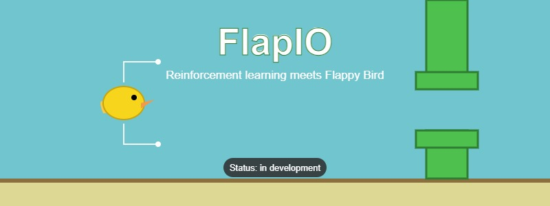

# FlapIO 🐦

[](#roadmap)
[](LICENSE)
[](https://www.python.org/)

<!-- TODO(you): swap in the real banner path once assets/ exists -->


> A reinforcement learning agent that learns to play Flappy Bird **entirely from scratch** — no hardcoded rules, no human demonstrations, no imitation learning. Just a custom Pygame clone, a Gymnasium environment, and a PPO agent (Stable-Baselines3) finding its own way from flapping randomly to clearing pipes, purely through reward-driven trial and error.

---

## Table of contents

- [About](#about)
- [How it works](#how-it-works)
- [Project structure](#project-structure)
- [Tech stack](#tech-stack)
- [Installation](#installation)
- [Usage](#usage)
- [The PPO agent](#the-ppo-agent)
- [Results](#results)
- [Team](#team)
- [Roadmap](#roadmap)
- [Contributing](#contributing)
- [License](#license)

---

## About

FlapIO is a 4-person Advanced Programming Lab project. The goal isn't just "an AI that plays Flappy Bird" — it's watching an agent go from doing nothing useful to consistently clearing pipes, having learned that entirely through PPO's reward signal, with zero hand-coded flying logic.

The project has three moving parts, built by three different roles (see [Team](#team)):

1. A **game** the agent can play against
2. An **environment** that exposes that game in the standard Gymnasium interface
3. An **agent** (PPO) that learns a policy against that environment

## How it works

1. **The game** (`FlappyBirdGame`) — a Pygame implementation with a `Bird` (gravity + flap) and a stream of `Pipe` obstacles.
   - `Pipe` — spawn, movement, collision rects, off-screen cleanup — **implemented** (see `pipe_game.py`).
   - `Bird` and the combined `FlappyBirdGame` loop (scoring, headless mode for training, rendered mode for demos) — **not yet built**.
2. **The environment** (`FlappyBirdEnv`) — a `gymnasium.Env` subclass wrapping the game — **not yet built**. Will expose:
   - **Observation space**: `[bird_y, bird_vel, dist_to_next_pipe_x, pipe_gap_y]`
   - **Action space**: `Discrete(2)` — flap or do nothing
   - **Reward**: small positive reward per frame survived, larger reward for passing a pipe, penalty on collision
3. **The agent** — PPO (Stable-Baselines3), trained against the environment for several hundred thousand timesteps. PPO clips how much the policy can change per update, which keeps training stable even while the reward function is still being tuned. **Implemented and smoke-tested** — see [The PPO agent](#the-ppo-agent).
4. **Evaluation** — checkpoints saved at multiple training stages (e.g. 10k, 100k, 500k steps) to record and compare the agent's progression, not just its final performance — **not yet built**.

## Project structure

Target layout (✅ = already in the repo, 🚧 = planned):

```
FlapIO/
├── game/
│   ├── bird.py            🚧 Bird physics
│   ├── pipe.py            🚧 Pipe spawning and movement (currently pipe_game.py at repo root)
│   └── flappy_game.py     🚧 Core game loop, collision, scoring, rendering
├── env/
│   └── flappy_env.py      🚧 Gymnasium wrapper around the game
├── agent/
│   ├── config.py          ✅ PPOConfig — every hyperparameter in one place
│   ├── policy.py          ✅ Custom feature-extractor network for the actor/critic
│   ├── agent.py           ✅ FlapIOAgent — predict / train / save / load
│   └── dummy_env.py       ✅ Mock env for smoke-testing the PPO pipeline standalone
├── train.py                ✅ Training script (PPO via Stable-Baselines3)
├── predict.py               ✅ obs -> action from a saved checkpoint
├── evaluate.py             🚧 Runs a trained model with rendering, records demo
├── assets/
│   └── banner.svg          🚧
├── logs/                    generated — TensorBoard training logs
├── models/                  generated — saved model checkpoints
├── pipe_game.py             ✅ current standalone Pipe implementation + demo loop
├── requirements.txt        ✅
└── README.md                ✅ (this file)
```

<!-- TODO(you): once game/ and env/ land, delete pipe_game.py or fold it into game/pipe.py -->

## Tech stack

| Component                | Library                 |
| ------------------------ | ------------------------ |
| Game engine               | Pygame                   |
| RL environment interface | Gymnasium                |
| RL algorithm               | PPO (Stable-Baselines3) |
| Neural nets                | PyTorch                  |
| Training monitoring       | TensorBoard              |

## Installation

```bash
git clone https://github.com/Flap-IO/FlapIO.git
cd FlapIO
python -m venv venv
source venv/bin/activate      # Windows: venv\Scripts\activate
pip install -r requirements.txt
```

`requirements.txt`:

```
pygame
gymnasium
stable-baselines3[extra]
torch
numpy
tensorboard
```

## Usage

**Play the current pipe demo:**

```bash
python pipe_game.py
```

**Train the PPO agent** (against the real env once it exists, or the mock env today):

```bash
python train.py --timesteps 1000000          # once env/flappy_env.py exists
python train.py --dummy-env --timesteps 20000 # smoke-test now, no game/env needed
```

**Watch training progress live:**

```bash
tensorboard --logdir ./logs
```

**Get an action from a trained model:**

```bash
python predict.py --model models/ppo_flapio_final.zip
```

**Evaluate a trained model** *(once `evaluate.py` is built)*:

```bash
python evaluate.py --model models/ppo_flapio_final.zip
```

## The PPO agent

The `agent/` package + `train.py` + `predict.py` are self-contained and already working (tested against `agent/dummy_env.py`, a mock that matches `FlappyBirdEnv`'s planned observation/action space, since the real env isn't built yet).

| File | Role |
|---|---|
| `agent/config.py` | `PPOConfig` — learning rate, `n_steps`, `batch_size`, `gamma`, `gae_lambda`, `clip_range`, network sizes, checkpoint/eval frequency. Change hyperparameters here only. |
| `agent/policy.py` | `FlapIOFeaturesExtractor` — small MLP that embeds the 4-value state before SB3's actor/critic heads. |
| `agent/agent.py` | `FlapIOAgent` wrapping SB3's `PPO`: `predict(obs)`, `train(total_timesteps)`, `save(path)`, `load(path)`. |
| `agent/dummy_env.py` | Mock `gymnasium.Env` with the same 4-float observation and `Discrete(2)` action space as the real `FlappyBirdEnv`, for testing without depending on the game/env teammates. |
| `train.py` | Builds a vectorized env, runs PPO, checkpoints every `checkpoint_freq` steps, evaluates every `eval_freq` steps, saves the final model. |
| `predict.py` | Loads a checkpoint and turns one observation into one action. |

Swapping the mock for the real environment once it lands requires no code changes to `train.py` — just drop `--dummy-env`, since both expose the same `gymnasium.Env` interface.

## Results

<!-- TODO(you): fill in once training against the real env is done -->
*Not yet available.* Once training completes this section will report: final average score, the reward curve, a checkpoint-by-checkpoint comparison (10k / 100k / 500k steps), total training time, and the hyperparameters used for the reported run.

## Team

Built as a 4-person Advanced Programming Lab project:

| Role                       | Responsibility                                                                 | Status |
| -------------------------- | ------------------------------------------------------------------------------- | ------ |
| Game Developer              | `FlappyBirdGame`, `Bird`, `Pipe` — core Pygame implementation                   | 🚧 `Pipe` done, `Bird` + game loop pending |
| RL Environment Engineer    | `FlappyBirdEnv` — Gymnasium wrapper, observation/action space, reward shaping | 🚧 pending |
| ML/Training Engineer        | PPO training loop, policy network, hyperparameter tuning, checkpointing, predict/save/load | ✅ done |
| Evaluation & Documentation | Demo recording, reward-curve analysis, report, presentation                    | 🚧 pending |

<!-- TODO(you): add names/GitHub handles per role if you want them public -->

## Roadmap

- [ ] `Bird` class (gravity, flap impulse, collision rect)
- [ ] `FlappyBirdGame` — combine `Bird` + `Pipe` into one loop, headless mode for training, scoring
- [ ] `FlappyBirdEnv` — Gymnasium wrapper, reward shaping
- [ ] Swap `agent/dummy_env.py` for the real env in `train.py`
- [ ] Full training run + checkpoint comparison
- [ ] `evaluate.py` — render + record a trained agent playing
- [ ] Compare PPO against DQN or A2C on the same environment
- [ ] Experiment with pixel-based (CNN) observations instead of hand-crafted state features
- [ ] Add difficulty scaling (variable pipe gap/speed) to test generalization

## Contributing

This is a lab project with a fixed 4-person team; not currently accepting outside PRs. Feel free to open an issue if you spot a bug.

## License

Apache-2.0 — see [LICENSE](LICENSE).
